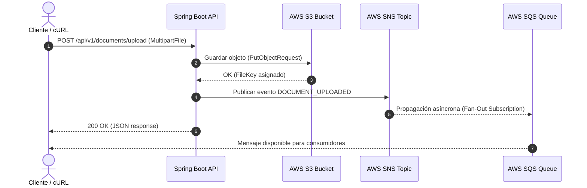

# Document Service — Event-Driven Architecture con Spring Boot, LocalStack y Terraform

Servicio backend de gestión de documentos y procesamiento asíncrono de eventos basado en un patrón **Fan-Out (SNS -> SQS)** y almacenamiento de objetos en **AWS S3**, simulado localmente mediante **LocalStack** e infraestructura como código (**Terraform**).

---

## 🏗️️ Arquitectura del Sistema



---

## 🛠️ Tecnologías Utilizadas

- **Lenguaje:** Java 17
- **Framework:** Spring Boot 3.2.4
- **SDK AWS:** AWS SDK for Java v2 (`software.amazon.awssdk`)
- **Cloud Local:** LocalStack (Docker)
- **IaC:** Terraform
- **Herramientas CLI:** `awslocal`, `mvn`, `curl` 

---

## 🚀 Requisitos Previos

1. **Docker** corriendo en el sistema.
2. **LocalStack** iniciado mediante el contenedor oficial:
   ```bash
   docker start localstack_main
   ```
3. **Terraform** e **awslocal** CLI instalados.

---

## ⚙️ Despliegue de la Infraestructura (Terraform)

Navegá al directorio de Terraform y aplicá la configuración:

```bash
cd terraform
terraform init
terraform apply -auto-approve
```

Esto creará automáticamente en LocalStack:
- **S3 Bucket:** `devops-app-storage-dev`
- **SNS Topic:** `document-events-topic`
- **SQS Queue:** `document-processing-queue`
- **Suscripción Fan-Out** y política de acceso entre SNS y SQS.

---

## 💻 Ejecución de la Aplicación

Volvé a la raíz del proyecto y ejecutá Spring Boot:

```bash
mvn clean spring-boot:run
```

El servicio estará escuchando en `http://localhost:8080`.

---

## 🧪 Validación y Pruebas End-to-End

### 1. Subir un archivo de prueba vía API REST

```bash
echo "Prueba de arquitectura orientada a eventos" > /tmp/prueba.txt

curl -X POST http://localhost:8080/api/v1/documents/upload \
  -F "file=@/tmp/prueba.txt"
```

### 2. Verificar persistencia en S3

```bash
awslocal s3 ls s3://devops-app-storage-dev
```

### 3. Verificar el evento propagado en SQS

```bash
awslocal sqs receive-message \
  --queue-url [http://sqs.us-east-1.localhost.localstack.cloud:4566/000000000000/document-processing-queue](http://sqs.us-east-1.localhost.localstack.cloud:4566/000000000000/document-processing-queue)
```
